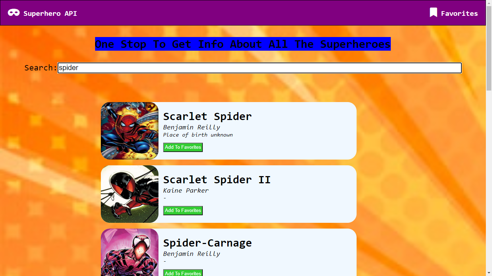

# Read Me Template

> This website is made using superheroApi(https://superheroapi.com/).
> The project can be found at: https://lakshdhamija.github.io/FindYourSuperHero/

---

### Table of Contents

- [Description](#description)
- [How To Use](#how-to-use)
- [References](#references)
- [Author Info](#author-info)

---

## Description

This front end makes use of superheroApi and can perform the following functions:-

Search for a superhero as you type the name.
Add/Remove Superhero from Favorites.
Click on Superhero Name to see the detailed stats page of the Superhero.

#### Technologies

- HTML
- CSS
- Javascript

---

## How To Use

#### Installation
To use, just clone or download the repository to your system and access the index.html file.

#### API Reference
> Base URL: https://superheroapi.com/api/{access-token}
> To Search: /search/{name}
> To see details of superhero: /{id}
> To see powerstats: /{id}/powerstats

## Reference

> SuperHeroAPI - https://superheroapi.com/

---

## Author Info

- LinkedIn - [@lakshdhamija](https://linkedin.com/laksh-dhamija)
